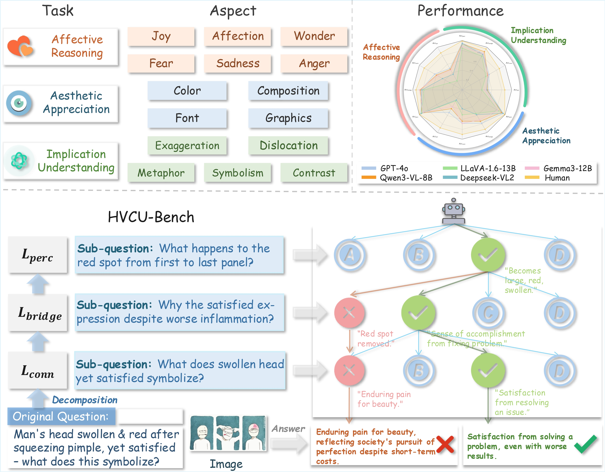

<div align="center">

# VCU-Bridge: Hierarchical Visual Connotation Understanding via Semantic Bridging

</div>

<p align="center">
  <h5 align="center">
    <a href="https://github.com/ZI-MA/VCU-Bridge">Ming Zhong</a><sup>1*</sup>,
    <a href="https://scholar.google.com/citations?user=sOC_TooAAAAJ">Yuanlei Wang</a><sup>3*</sup>,
    <a href="https://github.com/ZI-MA/VCU-Bridge">Liuzhou Zhang</a><sup>2</sup>,
    <a href="https://github.com/ZI-MA/VCU-Bridge">Arctanx An</a><sup>2</sup>,
    <a href="https://scholar.google.com/citations?user=YlL3xN4AAAAJ">Renrui Zhang</a><sup>4</sup>,
    <a href="https://scholar.google.com/citations?hl=zh-CN&user=HgapY3sAAAAJ">Hao Liang</a><sup>2</sup>,
    <a href="https://scholar.google.com/citations?user=3vArSU0AAAAJ">Ming Lu</a><sup>2</sup>,
    <a href="https://www.semanticscholar.org/author/Ying-Shen/143822679">Ying Shen</a><sup>3✉️</sup>,
    <a href="https://scholar.google.com/citations?user=JE4VON0AAAAJ">Wentao Zhang</a><sup>2✉️</sup>
    <br>
    <sup>1</sup>Zhejiang University,
    <sup>2</sup>Peking University,
    <sup>3</sup>Sun Yat-sen University,
    <sup>4</sup>CUHK
  </h5>
</p>

<div align="center">

[](https://arxiv.org/abs/2511.18121) [](https://vcu-bridge.github.io/) [](https://huggingface.co/datasets/Chime316/HVCU-Bench) [](https://opensource.org/licenses/Apache-2.0)

</div>

---

## 📋 Table of Contents

- [Overview](#-overview)
- [Project Structure](#-project-structure)
- [Key Features](#-key-features)
- [HVCU-Bench Dataset](#-hvcu-bench-dataset)
- [Installation](#-installation)
- [Quick Start](#-quick-start)
- [Performance](#-performance)
- [Data Generation Pipeline](#-data-generation-pipeline)
- [License](#-license)
- [Acknowledgments](#-acknowledgments)
- [Contact](#-contact)
- [Citation](#-citation)

---

## 🎯 Overview

**VCU-Bridge** is a comprehensive framework for evaluating and improving **Hierarchical Visual Connotation Understanding** in Multimodal Large Language Models (MLLMs). Unlike traditional benchmarks that test perception and reasoning in isolation, VCU-Bridge explicitly models the critical **semantic bridge** that connects low-level visual details to high-level abstract interpretations.

### HVCU-Bench Overview

<div align="left">
  
  <p><em>Overview of HVCU-Bench. We evaluate MLLMs across 3 task families spanning 15 diverse aspects. Our benchmark employs hierarchical decomposition: each question is systematically broken down into sub-questions across three levels (L<sub>perc</sub>, L<sub>bridge</sub>, L<sub>conn</sub>), with validation ensuring logical coherence. During evaluation, models progress from low to high levels, constructing inter-level reasoning chains that emulate human visual comprehension.</em></p>
</div>

### Core Contributions

- **📐 Novel Framework**: First to formalize hierarchical visual connotation understanding as a three-level progressive process with explicit inter-level associations
- **📊 HVCU-Bench**: A benchmark with 1,050 samples (3,150 QA pairs) covering Affective Reasoning, Aesthetic Appreciation, and Implication Understanding
- **🌲 MCTS Pipeline**: Monte Carlo Tree Search-driven data generation for creating high-quality hierarchical training data
- **✅ Proven Results**: Instruction-tuned models show +6.17% improvement on HVCU-Bench

---

## 📁 Project Structure

```
VCU-Bridge/
├── Data/                                # Benchmark data and images (download required)
│   ├── *.json                           # Task annotation files
│   └── Image/                           # Image directories by task
├── Evaluation/                          # Evaluation framework
│   ├── run_evaluation.py                # Main evaluation script
│   ├── calculate_metrics.py             # Metrics calculation
│   ├── base_evaluator.py                # Base evaluator classes
│   └── answer_parser.py                 # Answer parsing utilities
├── Instruction_Data_Generation_Pipeline/  # MCTS data generation
│   ├── main.py                          # Generation entry point
│   ├── config.py                        # Configuration management
│   ├── image_processor.py               # Image processing utilities
│   ├── configs/                         # Configuration files
│   ├── prompts/                         # Prompt templates
│   └── utils/                           # Core utilities
│       ├── orchestrator/                # MCTS orchestration
│       ├── services/                    # API clients and services
│       ├── tree/                        # MCTS tree implementation
│       ├── batch/                       # Batch processing
│       ├── formatter/                   # Data formatting
│       └── nodes/                       # MCTS node implementation
├── .env.example                          # Environment variables template
├── environment.yml                      # Conda environment file
├── pyproject.toml                       # Project configuration
├── setup.sh                             # Setup script
└── README.md                            # This file
```

### Core Modules

- **Evaluation Module**: Provides comprehensive evaluation framework for testing MLLMs on HVCU-Bench with support for multiple evaluators (OpenAI API and local models via vLLM)
- **Instruction_Data_Generation_Pipeline Module**: Implements MCTS-driven hierarchical data generation with quality filtering and diversity checking

---

## ✨ Key Features

### 🎯 Hierarchical Evaluation Framework

VCU-Bridge models visual understanding as a progressive three-level process:

**Level 1 - Foundational Perception** (*L<sub>perc</sub>*)
- Objective, low-level visual facts
- Direct observation of objects, attributes, and visual primitives
- Example: *"The image shows dark clouds and a person with a hunched posture"*

**Level 2 - Semantic Bridge** (*L<sub>bridge</sub>*)
- Explanatory statements linking perception to meaning
- Causal reasoning about visual evidence
- Example: *"The dark weather and body language create an atmosphere of isolation"*

**Level 3 - Abstract Connotation** (*L<sub>conn</sub>*)
- Subjective, high-level interpretations
- Aesthetic, affective, or symbolic meanings
- Example: *"The scene conveys a sense of melancholy and loneliness"*

### 🔬 MCTS-Driven Generation

- **Monte Carlo Tree Search** for exploring hierarchical reasoning paths
- **UCB (Upper Confidence Bound) selection** balancing exploration and exploitation
- **Progressive validation** ensuring logical coherence across levels
- **Quality filtering** with multi-dimensional evaluation criteria

### 📊 Comprehensive Tasks

- **Affective Reasoning** (300 samples): 6 emotional categories (joy, affection, wonder, anger, fear, sadness)
- **Aesthetic Appreciation** (350 samples): 4 design aspects (color, composition, font, graphics)
- **Implication Understanding** (400 samples): 5 rhetorical devices (metaphor, symbolism, contrast, exaggeration, dislocation)

### 🎛️ Flexible Evaluation

- **Independent Mode**: Test each level in isolation
- **Context Mode**: Evaluate with hierarchical dependencies
- **Diagnostic Metrics**: Per-level accuracy, full-chain accuracy, and error attribution

---

## 📊 HVCU-Bench Dataset

**HVCU-Bench** contains **1,050 samples** (3,150 QA pairs) across three task families:

- **Affective Reasoning** (300 samples): 6 emotional categories — joy, affection, wonder, anger, fear, sadness
- **Aesthetic Appreciation** (350 samples): 4 design aspects — color, composition, font, graphics  
- **Implication Understanding** (400 samples): 5 rhetorical devices — metaphor, symbolism, contrast, exaggeration, dislocation

### Dataset Statistics

- **Total Samples**: 1,050 images
- **Total QA Pairs**: 3,150 (3 levels × 1,050 samples)
- **Task Distribution**: 
  - Affective Reasoning: 28.6% (300 samples)
  - Aesthetic Appreciation: 33.3% (350 samples)
  - Implication Understanding: 38.1% (400 samples)

### Dataset Organization

The benchmark data is organized in the `Data/` directory:
- **JSON annotation files**: Task-specific annotation files containing QA pairs
  - `Aesthetic-Appreciation.json`
  - `Affective-Reasoning.json`
  - `Implication-Understanding.json`
- **Image directory**: Images organized by task family in `Data/Image/`
  - Each task has its own subdirectory containing all relevant images
  - Image filenames correspond to sample IDs in the JSON files
  - Supported formats: JPG, PNG, WEBP

### Download Dataset

The complete benchmark data (including both JSON annotation files and images) can be downloaded from:
- **Hugging Face**: [Chime316/HVCU-Bench](https://huggingface.co/datasets/Chime316/HVCU-Bench)

After downloading, place the data in the `Data/` directory with the following structure:

```
Data/
├── Aesthetic-Appreciation.json
├── Affective-Reasoning.json
├── Implication-Understanding.json
└── Image/
    ├── Aesthetic-Appreciation/
    ├── Affective-Reasoning/
    └── Implication-Understanding/
```

**Note**: Both JSON annotation files and Image directory are required for evaluation.

---

## 🛠️ Installation

### Prerequisites

- Python 3.10+
- Conda (recommended)

### Setup

1. **Clone the repository**

```bash
git clone https://github.com/ZI-MA/VCU-Bridge.git
cd VCU-Bridge
```

2. **Create environment**

```bash
# Option A: Automated setup
bash setup.sh

# Option B: Manual setup
conda env create -f environment.yml
conda activate vcu-bridge
pip install -e .
```

3. **Download benchmark data**

Download the benchmark data from [Hugging Face](https://huggingface.co/datasets/Chime316/HVCU-Bench) and place it in the `Data/` directory. See the [HVCU-Bench Dataset](#-hvcu-bench-dataset) section for detailed download instructions.

4. **Configure environment variables**

```bash
# Copy the example environment file
cp .env.example .env

# Edit .env with your API credentials
# For OpenAI/GPT models:
# OPENAI_API_KEY=your_api_key_here
# OPENAI_API_BASE=your_custom_base_url  # Optional

# For Google Gemini models:
# GEMINI_PROJECT_ID=your_project_id
# GEMINI_LOCATION=us-central1
# GEMINI_SERVICE_ACCOUNT_FILE=path/to/service_account.json

# Optional: Customize data directories
# DATA_DIR=Data
# RESULTS_DIR=Result
# IMAGE_DIR=Data/Image
```

---

## 🚀 Quick Start

### Evaluate a Model

```bash
# Evaluate GPT-4o on Implication Understanding (Independent Mode)
python -m Evaluation.run_evaluation openai \
  --input Implication-Understanding.json \
  --model gpt-4o

# Evaluate with context (hierarchical dependencies)
python -m Evaluation.run_evaluation openai \
  --input Implication-Understanding.json \
  --model gpt-4o \
  --context_mode

# Evaluate local model with vLLM
python -m Evaluation.run_evaluation local \
  --input Aesthetic-Appreciation.json \
  --model Qwen/Qwen3-VL-8B-Instruct

# Parallel evaluation for faster processing
python -m Evaluation.run_evaluation openai \
  --input Affective-Reasoning.json \
  --parallel 4
```

### Calculate Metrics

```bash
# Compute accuracy metrics from evaluation results
python -m Evaluation.calculate_metrics Result/Implication-Understanding/Indep/gpt_4o.json

# Output includes:
# - Per-Level Accuracy (Level 1, 2, 3)
# - Full-Chain Accuracy
# - Overall Score
# - Error Attribution Analysis (for reference only)
```

### Evaluate All Benchmarks

```bash
# Run complete evaluation suite
for task in Aesthetic-Appreciation Affective-Reasoning Implication-Understanding; do
  python -m Evaluation.run_evaluation openai --input ${task}.json --model gpt-4o
  python -m Evaluation.calculate_metrics Result/${task}/Indep/gpt_4o.json
done
```

### Evaluation Framework

The evaluation framework supports multiple evaluator types:

- **OpenAI Evaluator**: Uses OpenAI API (GPT-4o, GPT-4o-mini, etc.)
- **Local Evaluator**: Uses local models via vLLM or compatible APIs

#### Command-Line Options

| Argument | Type | Description |
|----------|------|-------------|
| `evaluator` | str | **Required**. Evaluator type: `openai` or `local` |
| `--input` | str | **Required**. Input JSON filename in `Data/` directory |
| `--model` | str | Model name (default: `gpt-4o` for openai, `Qwen/Qwen3-VL-8B-Instruct` for local) |
| `--context_mode` | flag | Enable context mode (with hierarchical dependencies) |
| `--parallel` | int | Number of parallel workers (default: 1) |
| `--temperature` | float | Sampling temperature (default: 0.0) |
| `--base_url` | str | Custom API base URL |

#### Evaluation Metrics

- **Per-Level Accuracy (Acc<sub>i</sub>)**: Correctness at each individual level
  - Acc<sub>perc</sub>: Level 1 (Foundational Perception) accuracy
  - Acc<sub>bridge</sub>: Level 2 (Semantic Bridge) accuracy
  - Acc<sub>conn</sub>: Level 3 (Abstract Connotation) accuracy

- **Full-Chain Accuracy (Acc<sub>full</sub>)**: Simultaneous correctness across all three levels
  - Most stringent metric requiring correct reasoning at all levels

- **Overall Score**: Mean of Acc<sub>full</sub> across all tasks
  - Single aggregate performance indicator

- **Error Attribution**: Identifies the first level where reasoning fails
  - Diagnostic metric for understanding failure patterns

#### Result Analysis

Results are saved in JSON format. Use `calculate_metrics.py` to compute aggregated statistics from result files.

---

## 🏆 Performance

### Main Results on HVCU-Bench

**Overall Performance Table** - Best results in **bold**, second-best <u>underlined</u>:

<table>
<thead>
  <tr>
    <th rowspan="2">Model</th>
    <th rowspan="2">Size</th>
    <th colspan="4">Implication Understanding</th>
    <th colspan="4">Aesthetic Appreciation</th>
    <th colspan="4">Affective Reasoning</th>
    <th rowspan="2"><i>Score</i></th>
  </tr>
  <tr>
    <th>Acc<sub>perc</sub></th>
    <th>Acc<sub>bridge</sub></th>
    <th>Acc<sub>conn</sub></th>
    <th>Acc<sub>full</sub></th>
    <th>Acc<sub>perc</sub></th>
    <th>Acc<sub>bridge</sub></th>
    <th>Acc<sub>conn</sub></th>
    <th>Acc<sub>full</sub></th>
    <th>Acc<sub>perc</sub></th>
    <th>Acc<sub>bridge</sub></th>
    <th>Acc<sub>conn</sub></th>
    <th>Acc<sub>full</sub></th>
  </tr>
</thead>
<tbody>
  <tr style="background-color: #f0f0f0;">
    <td colspan="15"><b>Basic Reference</b></td>
  </tr>
  <tr>
    <td><b>Human</b></td>
    <td>-</td>
    <td>99.25</td>
    <td>96.00</td>
    <td>86.50</td>
    <td>86.00</td>
    <td>99.14</td>
    <td>92.29</td>
    <td>90.29</td>
    <td>88.86</td>
    <td>99.33</td>
    <td>93.33</td>
    <td>88.67</td>
    <td>86.67</td>
    <td><b>87.18</b></td>
  </tr>
  <tr>
    <td>GPT-4o</td>
    <td>-</td>
    <td><b>95.50</b></td>
    <td><u>85.25</u></td>
    <td><b>62.75</b></td>
    <td><b>53.25</b></td>
    <td><b>95.43</b></td>
    <td><b>78.29</b></td>
    <td><b>68.00</b></td>
    <td><b>53.14</b></td>
    <td>91.33</td>
    <td>83.67</td>
    <td><b>64.33</b></td>
    <td><b>50.33</b></td>
    <td><b>52.24</b></td>
  </tr>
  <tr style="background-color: #f0f0f0;">
    <td colspan="15"><b>Open-Source MLLMs</b></td>
  </tr>
  <tr>
    <td>Qwen3-VL-Instruct</td>
    <td>4B</td>
    <td>86.75</td>
    <td>82.75</td>
    <td>58.00</td>
    <td>43.25</td>
    <td>90.57</td>
    <td>70.86</td>
    <td>60.00</td>
    <td>41.14</td>
    <td>90.33</td>
    <td>82.67</td>
    <td>56.67</td>
    <td>39.33</td>
    <td>41.24</td>
  </tr>
  <tr>
    <td>Qwen3-VL-Instruct</td>
    <td>8B</td>
    <td>93.50</td>
    <td><b>89.50</b></td>
    <td>59.50</td>
    <td><u>50.75</u></td>
    <td>91.71</td>
    <td><u>73.43</u></td>
    <td><u>63.43</u></td>
    <td><u>44.00</u></td>
    <td><u>94.33</u></td>
    <td>84.67</td>
    <td>60.00</td>
    <td><u>48.00</u></td>
    <td><u>47.58</u></td>
  </tr>
  <tr>
    <td>LLaVA-1.6</td>
    <td>7B</td>
    <td>81.75</td>
    <td>58.00</td>
    <td>40.25</td>
    <td>18.75</td>
    <td>79.14</td>
    <td>36.86</td>
    <td>33.14</td>
    <td>9.43</td>
    <td>92.00</td>
    <td>58.00</td>
    <td>19.33</td>
    <td>12.00</td>
    <td>13.39</td>
  </tr>
  <tr>
    <td>LLaVA-1.6</td>
    <td>13B</td>
    <td>84.75</td>
    <td>79.00</td>
    <td>55.00</td>
    <td>39.50</td>
    <td>84.86</td>
    <td>55.14</td>
    <td>50.57</td>
    <td>26.29</td>
    <td><u>94.33</u></td>
    <td>77.33</td>
    <td>29.00</td>
    <td>21.33</td>
    <td>29.04</td>
  </tr>
  <tr>
    <td>Deepseek-VL2-tiny</td>
    <td>MoE 1B/3B</td>
    <td>88.25</td>
    <td>62.25</td>
    <td>49.75</td>
    <td>29.25</td>
    <td>89.71</td>
    <td>45.14</td>
    <td>41.14</td>
    <td>19.71</td>
    <td>93.33</td>
    <td>65.33</td>
    <td>29.00</td>
    <td>19.00</td>
    <td>22.65</td>
  </tr>
  <tr>
    <td>Deepseek-VL2</td>
    <td>MoE 4.5B/27B</td>
    <td><u>93.75</u></td>
    <td>83.00</td>
    <td>60.75</td>
    <td>49.50</td>
    <td><u>95.14</u></td>
    <td>58.00</td>
    <td>38.00</td>
    <td>23.71</td>
    <td><b>96.33</b></td>
    <td>81.33</td>
    <td>46.00</td>
    <td>36.67</td>
    <td>36.63</td>
  </tr>
  <tr>
    <td>Gemma3</td>
    <td>4B</td>
    <td>76.50</td>
    <td>72.00</td>
    <td>49.75</td>
    <td>30.75</td>
    <td>68.86</td>
    <td>62.86</td>
    <td><b>68.00</b></td>
    <td>29.14</td>
    <td>87.00</td>
    <td>76.00</td>
    <td>51.00</td>
    <td>36.00</td>
    <td>31.96</td>
  </tr>
  <tr>
    <td>Gemma3</td>
    <td>12B</td>
    <td>87.50</td>
    <td><u>85.25</u></td>
    <td>60.50</td>
    <td>47.50</td>
    <td>82.86</td>
    <td>70.29</td>
    <td><b>68.00</b></td>
    <td>38.86</td>
    <td>90.67</td>
    <td><b>86.33</b></td>
    <td>58.00</td>
    <td>46.33</td>
    <td>44.23</td>
  </tr>
  <tr>
    <td>InternVL3.5</td>
    <td>4B</td>
    <td>82.50</td>
    <td>83.75</td>
    <td>58.50</td>
    <td>42.00</td>
    <td>82.86</td>
    <td>64.57</td>
    <td>40.00</td>
    <td>23.43</td>
    <td>91.00</td>
    <td>81.67</td>
    <td><u>60.67</u></td>
    <td>47.67</td>
    <td>37.70</td>
  </tr>
  <tr>
    <td>InternVL3.5</td>
    <td>8B</td>
    <td>82.00</td>
    <td><u>85.25</u></td>
    <td>55.75</td>
    <td>41.75</td>
    <td>84.00</td>
    <td>68.00</td>
    <td>60.57</td>
    <td>36.29</td>
    <td>86.00</td>
    <td>83.67</td>
    <td>55.67</td>
    <td>42.00</td>
    <td>40.01</td>
  </tr>
  <tr>
    <td>Phi-4-Multimodal-Instruct</td>
    <td>6B</td>
    <td>90.25</td>
    <td>56.50</td>
    <td>42.75</td>
    <td>32.25</td>
    <td>90.29</td>
    <td>42.57</td>
    <td>23.14</td>
    <td>15.14</td>
    <td>90.00</td>
    <td><u>85.00</u></td>
    <td>45.33</td>
    <td>33.67</td>
    <td>27.02</td>
  </tr>
  <tr>
    <td>Phi-3.5-Vision-Instruct</td>
    <td>4B</td>
    <td>84.25</td>
    <td>83.25</td>
    <td><u>61.25</u></td>
    <td>44.75</td>
    <td>88.29</td>
    <td>61.14</td>
    <td>53.43</td>
    <td>33.14</td>
    <td>91.33</td>
    <td>82.00</td>
    <td>54.33</td>
    <td>41.33</td>
    <td>39.74</td>
  </tr>
</tbody>
</table>

### Results with Context Mode

**Overall Performance Table (Context Setting)** - Results when models are provided with hierarchical context from previous levels:

<table>
<thead>
  <tr>
    <th rowspan="2">Model</th>
    <th rowspan="2">Size</th>
    <th colspan="4">Implication Understanding</th>
    <th colspan="4">Aesthetic Appreciation</th>
    <th colspan="4">Affective Reasoning</th>
    <th rowspan="2"><i>Score</i></th>
  </tr>
  <tr>
    <th>Acc<sub>perc</sub></th>
    <th>Acc<sub>bridge</sub></th>
    <th>Acc<sub>conn</sub></th>
    <th>Acc<sub>full</sub></th>
    <th>Acc<sub>perc</sub></th>
    <th>Acc<sub>bridge</sub></th>
    <th>Acc<sub>conn</sub></th>
    <th>Acc<sub>full</sub></th>
    <th>Acc<sub>perc</sub></th>
    <th>Acc<sub>bridge</sub></th>
    <th>Acc<sub>conn</sub></th>
    <th>Acc<sub>full</sub></th>
  </tr>
</thead>
<tbody>
  <tr style="background-color: #f0f0f0;">
    <td colspan="15"><b>Basic Reference</b></td>
  </tr>
  <tr>
    <td>GPT-4o</td>
    <td>-</td>
    <td>95.50</td>
    <td>89.75</td>
    <td>76.50</td>
    <td>65.00</td>
    <td>95.43</td>
    <td>82.29</td>
    <td>87.71</td>
    <td>72.86</td>
    <td>91.33</td>
    <td>86.00</td>
    <td>80.67</td>
    <td>66.67</td>
    <td>68.18</td>
  </tr>
  <tr style="background-color: #f0f0f0;">
    <td colspan="15"><b>Open-Source MLLMs</b></td>
  </tr>
  <tr>
    <td>Qwen3-VL-Instruct</td>
    <td>4B</td>
    <td>86.75</td>
    <td>85.50</td>
    <td>70.75</td>
    <td>54.50</td>
    <td>90.57</td>
    <td>72.86</td>
    <td>74.00</td>
    <td>53.14</td>
    <td>90.33</td>
    <td>86.00</td>
    <td>74.33</td>
    <td>57.67</td>
    <td>55.10</td>
  </tr>
  <tr>
    <td>Qwen3-VL-Instruct</td>
    <td>8B</td>
    <td>93.50</td>
    <td>90.00</td>
    <td>74.75</td>
    <td>62.75</td>
    <td>91.71</td>
    <td>74.00</td>
    <td>82.57</td>
    <td>59.43</td>
    <td>94.33</td>
    <td>89.00</td>
    <td>76.00</td>
    <td>64.67</td>
    <td>62.28</td>
  </tr>
  <tr>
    <td>LLaVA-1.6</td>
    <td>7B</td>
    <td>81.75</td>
    <td>68.00</td>
    <td>54.50</td>
    <td>32.75</td>
    <td>79.14</td>
    <td>43.71</td>
    <td>50.00</td>
    <td>18.29</td>
    <td>92.00</td>
    <td>65.00</td>
    <td>30.00</td>
    <td>18.67</td>
    <td>23.24</td>
  </tr>
  <tr>
    <td>LLaVA-1.6</td>
    <td>13B</td>
    <td>84.75</td>
    <td>80.25</td>
    <td>63.00</td>
    <td>44.75</td>
    <td>84.86</td>
    <td>57.71</td>
    <td>52.00</td>
    <td>29.14</td>
    <td>94.33</td>
    <td>78.00</td>
    <td>37.67</td>
    <td>27.33</td>
    <td>33.74</td>
  </tr>
  <tr>
    <td>Deepseek-VL2-tiny</td>
    <td>MoE 1B/3B</td>
    <td>88.25</td>
    <td>65.25</td>
    <td>55.75</td>
    <td>34.25</td>
    <td>89.71</td>
    <td>47.71</td>
    <td>60.57</td>
    <td>27.43</td>
    <td>93.33</td>
    <td>68.33</td>
    <td>33.00</td>
    <td>23.00</td>
    <td>28.23</td>
  </tr>
  <tr>
    <td>Deepseek-VL2</td>
    <td>MoE 4.5B/27B</td>
    <td>93.75</td>
    <td>84.25</td>
    <td>67.50</td>
    <td>53.75</td>
    <td>95.14</td>
    <td>59.43</td>
    <td>54.00</td>
    <td>33.43</td>
    <td>96.33</td>
    <td>83.67</td>
    <td>62.00</td>
    <td>52.00</td>
    <td>46.39</td>
  </tr>
  <tr>
    <td>Gemma3</td>
    <td>4B</td>
    <td>76.50</td>
    <td>78.25</td>
    <td>63.50</td>
    <td>40.75</td>
    <td>68.86</td>
    <td>65.14</td>
    <td>82.57</td>
    <td>35.43</td>
    <td>87.00</td>
    <td>75.00</td>
    <td>50.00</td>
    <td>33.00</td>
    <td>36.39</td>
  </tr>
  <tr>
    <td>Gemma3</td>
    <td>12B</td>
    <td>87.50</td>
    <td>88.00</td>
    <td>74.50</td>
    <td>57.00</td>
    <td>82.86</td>
    <td>72.57</td>
    <td>84.86</td>
    <td>50.00</td>
    <td>90.67</td>
    <td>86.00</td>
    <td>74.33</td>
    <td>59.67</td>
    <td>55.56</td>
  </tr>
  <tr>
    <td>InternVL3.5</td>
    <td>4B</td>
    <td>82.50</td>
    <td>80.75</td>
    <td>66.75</td>
    <td>46.00</td>
    <td>82.86</td>
    <td>65.43</td>
    <td>64.00</td>
    <td>36.86</td>
    <td>91.00</td>
    <td>82.33</td>
    <td>79.00</td>
    <td>60.33</td>
    <td>47.73</td>
  </tr>
  <tr>
    <td>InternVL3.5</td>
    <td>8B</td>
    <td>82.00</td>
    <td>84.75</td>
    <td>66.00</td>
    <td>47.25</td>
    <td>84.00</td>
    <td>70.57</td>
    <td>71.14</td>
    <td>45.43</td>
    <td>86.00</td>
    <td>81.67</td>
    <td>68.00</td>
    <td>50.33</td>
    <td>47.67</td>
  </tr>
  <tr>
    <td>Phi-4-Multimodal-Instruct</td>
    <td>6B</td>
    <td>90.25</td>
    <td>84.75</td>
    <td>68.00</td>
    <td>54.50</td>
    <td>90.29</td>
    <td>61.71</td>
    <td>50.86</td>
    <td>32.86</td>
    <td>90.00</td>
    <td>86.33</td>
    <td>59.67</td>
    <td>45.00</td>
    <td>44.12</td>
  </tr>
  <tr>
    <td>Phi-3.5-Vision-Instruct</td>
    <td>4B</td>
    <td>84.25</td>
    <td>84.00</td>
    <td>71.50</td>
    <td>51.25</td>
    <td>88.29</td>
    <td>63.43</td>
    <td>64.00</td>
    <td>40.00</td>
    <td>91.33</td>
    <td>81.33</td>
    <td>64.67</td>
    <td>49.33</td>
    <td>46.86</td>
  </tr>
</tbody>
</table>

### Key Findings

1. **👥 Gap between Humans and MLLMs**: Humans achieve 87.18% overall score, while GPT-4o and Qwen3-VL-8B-Instruct fall behind by -34.94% and -39.60% respectively, demonstrating that current MLLMs lack a stable semantic bridge from concrete evidence to abstract meaning.

2. **📉 Universal Performance Degradation**: Most models, regardless of scale or architecture, exhibit a sharp, cascading decline from perception → bridge → connotation. GPT-4o experiences -32.75% degradation, Qwen3-VL-8B-Instruct degrades by -34.00% on Implication Understanding.

3. **📊 Model Scale and Architecture Analysis**: While increasing model scale generally improves performance, it does not resolve the fundamental challenges. LLaVA-1.6-13B significantly outperforms its 7B counterpart (29.04% vs 13.39%), yet performance at L<sub>conn</sub> remains weak. Different architectures show distinct profiles: Qwen3-VL exhibits more balanced performance, while LLaVA-1.6 shows a particularly steep decline after L<sub>perc</sub>.

4. **🔗 Hierarchical Dependencies**: Providing hierarchical context yields substantial performance gains. GPT-4o demonstrates +15.94% overall improvement, while Qwen3-VL-8B-Instruct achieves +14.70%, confirming that lower levels provide critical grounding for higher-level connotative reasoning.

---

## 🌲 Data Generation Pipeline

Our MCTS-driven pipeline generates high-quality hierarchical training data through iterative tree search:

### Key Components

1. **Selection**: UCB (Upper Confidence Bound) algorithm balances exploration and exploitation
2. **Expansion**: Generate candidate QA pairs at each level
3. **Evaluation**: Multi-dimensional quality assessment (logical coherence, difficulty progression, image-text alignment)
4. **Backpropagation**: Update node statistics to guide future exploration

### Generate Training Data

```bash
# Configure data generation settings
cd Instruction_Data_Generation_Pipeline
cp configs/config.example.json configs/config.json
# Edit config.json with your settings

# Run MCTS-based generation
python -m Instruction_Data_Generation_Pipeline.main \
  --config configs/config.json

# Generated data will be saved as JSONL files with complete reasoning chains
```

### Configuration Options

Key parameters in `config.json`:

- **MCTS Parameters**:
  - `mcts.max_iterations`: Maximum MCTS iterations (default: 5)
  - `mcts.max_depth`: Number of hierarchy levels (default: 3)
  - `mcts.exploration_constant`: UCB exploration parameter (default: 2.0)

- **Tree Structure**:
  - `tree.levels`: Per-level node capacity limits
  - `tree.max_children`: Maximum children per node
  - `tree.max_total_nodes`: Total node limit

- **Quality Control**:
  - `tree.quality.thresholds`: Quality score thresholds (high/medium)
  - `tree.quality.acceptance_threshold`: Minimum score for admission (default: 0.65)

- **Parallel Processing**:
  - `parallel.images`: Number of parallel image workers (default: 10)
  - `parallel.nodes`: Number of parallel node expansions (default: 5)
  - `client.max_concurrency`: API concurrency limit (default: 50)

### Advanced Features

- **Resume Mechanism**: Automatically detects and skips completed images based on tree output
- **Tree State Persistence**: Saves and loads MCTS tree states for checkpointing
- **Batch Processing**: Parallel candidate generation and evaluation
- **Quality Filtering**: Multi-dimensional evaluation with logical coherence checks

---

## 📜 License

This project is licensed under the Apache License 2.0. See the [LICENSE](LICENSE) file for details.

---

## 🙏 Acknowledgments

We thank the following projects and datasets for providing valuable resources:

- **[II-Bench](https://ii-bench.github.io)**, **[EEmo-Bench](https://github.com/workerred/EEmo-Bench)**, and **[LayerD](https://cyberagentailab.github.io/LayerD/)** for providing valuable resources for our benchmark
- **OpenAI**, **Google**, and the open-source community for providing excellent MLLMs and APIs

---

## 📧 Contact

For questions, issues, or collaboration opportunities:

- **Email**: [chime@zju.edu.cn](mailto:chime@zju.edu.cn)
- **GitHub Issues**: [Open an issue](https://github.com/ZI-MA/VCU-Bridge/issues)
- **Project Page**: [https://vcu-bridge.github.io/](https://vcu-bridge.github.io/)

---

## 📄 Citation

If you find this work useful in your research, please cite:

```bibtex
@misc{zhong2025vcubridgehierarchicalvisualconnotation,
      title={VCU-Bridge: Hierarchical Visual Connotation Understanding via Semantic Bridging}, 
      author={Ming Zhong and Yuanlei Wang and Liuzhou Zhang and Arctanx An and Renrui Zhang and Hao Liang and Ming Lu and Ying Shen and Wentao Zhang},
      year={2025},
      eprint={2511.18121},
      archivePrefix={arXiv},
      primaryClass={cs.CV},
      url={https://arxiv.org/abs/2511.18121}, 
}
```
